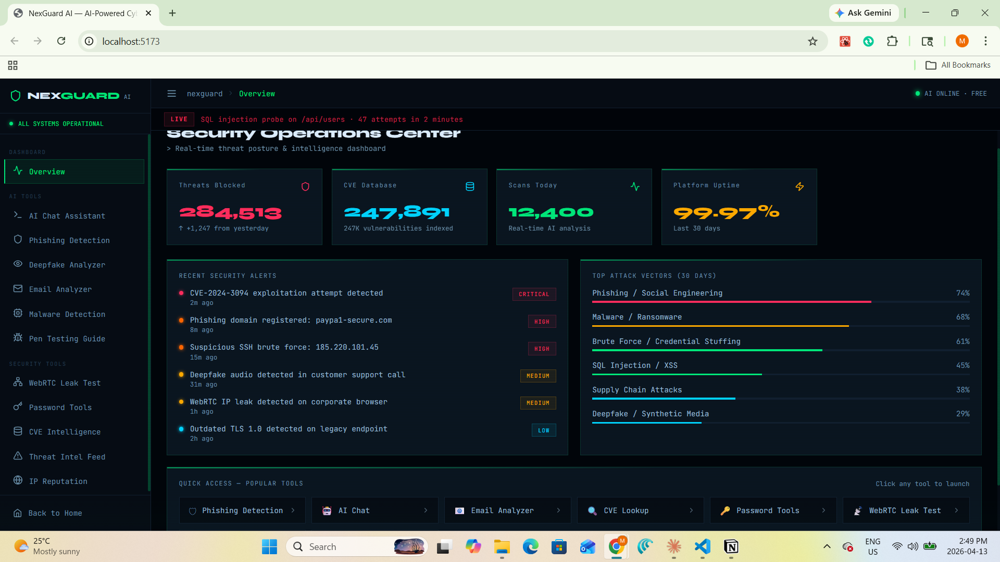

<div align="center">

```
███╗   ██╗███████╗██╗  ██╗ ██████╗ ██╗   ██╗ █████╗ ██████╗ ██████╗      █████╗ ██╗
████╗  ██║██╔════╝╚██╗██╔╝██╔════╝ ██║   ██║██╔══██╗██╔══██╗██╔══██╗    ██╔══██╗██║
██╔██╗ ██║█████╗   ╚███╔╝ ██║  ███╗██║   ██║███████║██████╔╝██║  ██║    ███████║██║
██║╚██╗██║██╔══╝   ██╔██╗ ██║   ██║██║   ██║██╔══██║██╔══██╗██║  ██║    ██╔══██║██║
██║ ╚████║███████╗██╔╝ ██╗╚██████╔╝╚██████╔╝██║  ██║██║  ██║██████╔╝    ██║  ██║██║
╚═╝  ╚═══╝╚══════╝╚═╝  ╚═╝ ╚═════╝  ╚═════╝ ╚═╝  ╚═╝╚═╝  ╚═╝╚═════╝     ╚═╝  ╚═╝╚═╝
```

**AI-Powered Cybersecurity Platform**

[](https://nodejs.org)
[](https://reactjs.org)
[](https://anthropic.com)
[](LICENSE)
[](CONTRIBUTING.md)

**No login required · 100% AI-powered · 12 security tools · Real-time threat intel**

[🚀 Live Demo](#) · [📖 Docs](#setup) · [🐛 Report Bug](issues) · [💡 Request Feature](issues)

</div>

---

## 📸 Screenshots

> Dashboard Overview · AI Chat · Phishing Detection · Threat Intel Feed




---

## ✨ Features

### 🤖 AI-Powered Tools
| Tool | Description |
|------|-------------|
| **AI Chat Assistant** | 24/7 expert cybersecurity analyst powered by Claude AI. CVEs, malware, forensics, OSINT |
| **Phishing Detection** | Real-time URL & content analysis — typosquatting, spoofing, social engineering |
| **Deepfake Analyzer** | Upload images/video/audio for AI detection of synthetic media & voice cloning |
| **Email Analyzer** | Full forensics: SPF/DKIM/DMARC, BEC patterns, header analysis, social engineering |
| **Malware Detection** | Submit hashes, code, or behavioral logs — MITRE ATT&CK mapping + IOC extraction |
| **Pen Testing Guide** | OWASP/PTES/NIST aligned methodology with tool recommendations |

### 🔒 Security Tools
| Tool | Description |
|------|-------------|
| **WebRTC Leak Test** | Real browser test — detects IP leaks via ICE candidates, even behind VPN |
| **Password Analyzer** | Entropy scoring, crack time estimation, 8-point criteria check |
| **Password Generator** | Cryptographically secure passwords up to 128 characters |
| **Hash Identifier** | AI identifies MD5, SHA-256, bcrypt, NTLM, Argon2 and 50+ hash formats |
| **CVE Intelligence** | Deep analysis with CVSS scoring, exploitation status, remediation steps |
| **Threat Intel Feed** | **Live CVEs from NVD** — refreshed daily, CVSS ≥ 7.0, click for AI analysis |
| **IP Reputation** | AI-powered IP threat analysis — Tor nodes, VPN, botnet C2, geolocation |

---

## 🚀 Quick Start

### Prerequisites
- [Node.js](https://nodejs.org) v18 or higher
- [Git](https://git-scm.com)
- Anthropic API key (optional — runs in demo mode without it)

### 1. Clone the Repository

git clone https://github.com/YOUR_USERNAME/nexguard-ai.git
cd nexguard-ai


### 2. Setup Backend

cd backend
npm install
cp .env.example .env


Edit `.env` and add your API key:

ANTHROPIC_API_KEY=sk-ant-your-key-here
PORT=3001
FRONTEND_URL=http://localhost:5173


> 💡 **No API key?** The platform runs in **Demo Mode** with realistic mock responses. Get a free key at [console.anthropic.com](https://console.anthropic.com)

### 3. Start Backend

npm run dev

You should see:

✅ API key detected — LIVE mode
🛡️  NexGuard AI Backend running on port 3001


### 4. Setup & Start Frontend

# New terminal
cd frontend
npm install
npm run dev


### 5. Open in Browser

http://localhost:5173


---

## 📁 Project Structure
```
nexguard-ai/
│
├── backend/                        # Node.js + Express API
│   ├── routes/
│   │   ├── ai.js                   # All Claude AI endpoints
│   │   └── tools.js                # Security tools + NVD live feed
│   ├── server.js                   # Express server, CORS, rate limiting
│   ├── .env.example                # Environment template
│   └── package.json
│
└── frontend/                       # React 18 + Vite
    ├── src/
    │   ├── pages/
    │   │   ├── Landing.jsx         # Interactive landing page
    │   │   └── Dashboard.jsx       # Main app shell + sidebar
    │   ├── components/
    │   │   ├── MatrixRain.jsx      # Animated matrix background
    │   │   └── ThreatTicker.jsx    # Live threat scroll ticker
    │   ├── tools/                  # All 12 security tool components
    │   │   ├── Overview.jsx
    │   │   ├── AIChat.jsx
    │   │   ├── PhishingDetector.jsx
    │   │   ├── DeepfakeAnalyzer.jsx
    │   │   ├── EmailAnalyzer.jsx
    │   │   ├── WebRTCChecker.jsx
    │   │   ├── PasswordTools.jsx
    │   │   ├── PenTesting.jsx
    │   │   ├── MalwareDetector.jsx
    │   │   ├── CVELookup.jsx
    │   │   ├── ThreatIntel.jsx
    │   │   └── IPReputation.jsx
    │   ├── styles/
    │   │   └── globals.css         # Full design system
    │   ├── App.jsx
    │   └── main.jsx
    ├── index.html
    ├── vite.config.js
    └── package.json
```
---

## 🔌 API Endpoints

### AI Endpoints (`/api/ai/`)
| Method | Endpoint | Description |
|--------|----------|-------------|
| POST | `/api/ai/chat` | AI security chat (full conversation history) |
| POST | `/api/ai/phishing` | Phishing URL/content analysis |
| POST | `/api/ai/deepfake` | Deepfake description analysis |
| POST | `/api/ai/deepfake-file` | Deepfake file upload (image/video/audio) |
| POST | `/api/ai/email` | Email forensics analysis |
| POST | `/api/ai/cve` | CVE deep analysis |
| POST | `/api/ai/malware` | Malware sample analysis |
| POST | `/api/ai/pentest` | Pen testing methodology |
| POST | `/api/ai/password` | Password strength analysis |
| POST | `/api/ai/hash` | Hash identification |
| POST | `/api/ai/ip` | IP reputation analysis |

### Tool Endpoints (`/api/tools/`)
| Method | Endpoint | Description |
|--------|----------|-------------|
| GET | `/api/tools/threat-feed` | Live CVE feed from NVD |
| GET | `/api/tools/webrtc-config` | WebRTC test configuration |
| POST | `/api/tools/generate-password` | Secure password generator |
| GET | `/api/stats` | Platform statistics |
| GET | `/api/health` | Health check |

---

## 🛠️ Tech Stack

| Layer | Technology |
|-------|-----------|
| **Frontend** | React 18, Vite, Lucide Icons |
| **Styling** | Custom CSS Design System (no UI library) |
| **Backend** | Node.js, Express 4 |
| **AI Engine** | Anthropic Claude (claude-sonnet-4-20250514) |
| **File Upload** | Multer (images analyzed with Claude Vision) |
| **Threat Feed** | NVD (National Vulnerability Database) API |
| **Rate Limiting** | express-rate-limit |
| **Security** | Helmet.js, CORS |

---

## 🔐 Security & Privacy

- **No user data stored** — all analysis is stateless
- **API key protected** — stored in `.env`, never exposed to frontend
- **Rate limiting** — 100 req/15min general, 20 req/min for AI endpoints
- **File uploads** — processed in memory only, never written to disk
- **WebRTC test** — runs entirely in browser, nothing sent to server

---

## ⚙️ Configuration

### Environment Variables (`backend/.env`)

# Required for live AI features
ANTHROPIC_API_KEY=sk-ant-...

# Server
PORT=3001

# CORS — set to your frontend URL
FRONTEND_URL=http://localhost:5173

# Environment
NODE_ENV=development

### Rate Limits (configurable in `server.js`)
// General API
windowMs: 15 * 60 * 1000,  // 15 minutes
max: 100                     // requests per window

// AI endpoints
windowMs: 60 * 1000,        // 1 minute  
max: 20                      // AI calls per minute

---

## 🌐 Deployment

### Deploy Backend (Railway / Render / Fly.io)

# Set environment variables in your hosting dashboard:
ANTHROPIC_API_KEY=sk-ant-...
PORT=3001
FRONTEND_URL=https://your-frontend-domain.com
NODE_ENV=production

### Deploy Frontend (Vercel / Netlify)
cd frontend
npm run build
# Deploy the dist/ folder

Update `vite.config.js` proxy target to your deployed backend URL for production.

---

## 🤝 Contributing

Contributions are welcome! Here's how:

1. **Fork** the repository
2. Create a feature branch: `git checkout -b feature/amazing-tool`
3. Commit your changes: `git commit -m "Add amazing security tool"`
4. Push to the branch: `git push origin feature/amazing-tool`
5. Open a **Pull Request**

### Ideas for contributions
- [ ] Real-time VirusTotal / AbuseIPDB API integration
- [ ] DNS lookup & WHOIS tool
- [ ] SSL/TLS certificate analyzer
- [ ] Subdomain enumeration tool
- [ ] Dark web breach checker
- [ ] Network port scanner (educational)

---

## ⚠️ Legal Disclaimer

> NexGuard AI is designed for **authorized security research, education, and defensive purposes only**.
>
> - The penetration testing guide is for use on systems you **own or have explicit written permission** to test
> - Unauthorized access to computer systems is **illegal** in most jurisdictions
> - The developers are not responsible for misuse of this tool
> - Always comply with applicable laws and regulations

---

## 📄 License

This project is licensed under the **MIT License** — see the [LICENSE](LICENSE) file for details.

---

## 🙏 Acknowledgements

- [Anthropic](https://anthropic.com) — Claude AI powering all security analysis
- [NVD / NIST](https://nvd.nist.gov) — Real-time CVE vulnerability database
- [Lucide Icons](https://lucide.dev) — Icon library
- [MITRE ATT&CK](https://attack.mitre.org) — Threat framework reference

---

<div align="center">

**Built with ❤️ and Claude AI**

⭐ Star this repo if you find it useful!

</div>
